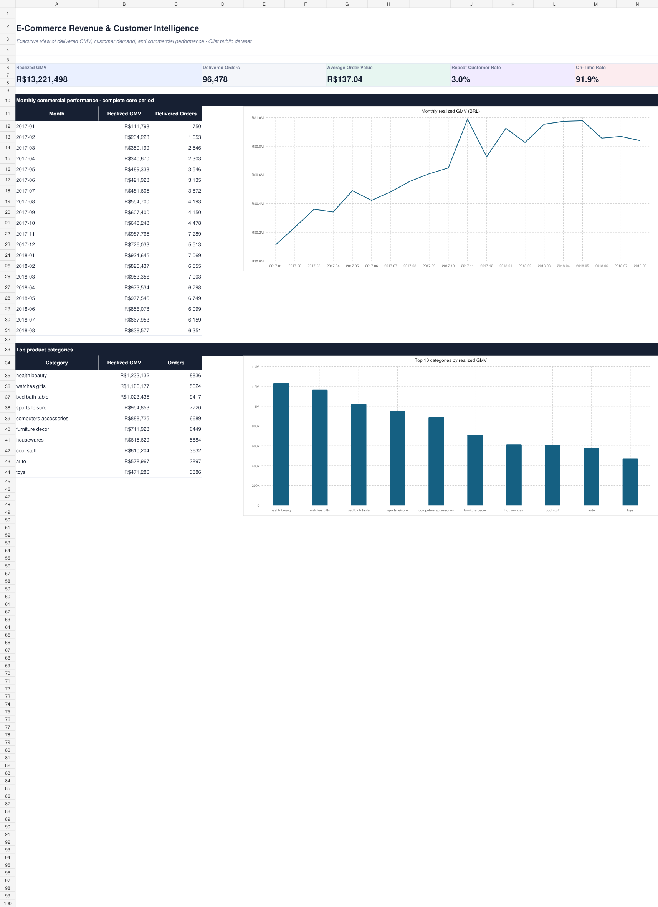
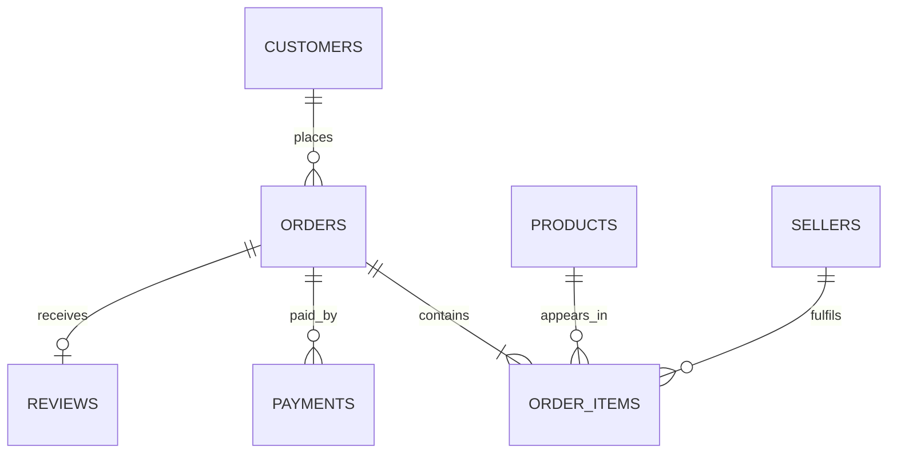

# Ecommerce Revenue Customer Intelligence Project
An end-to-end data analytics project that transforms raw e-commerce data into actionable business insights through Python, SQL, Power BI, and interactive dashboards.


## Live Project

> Replace the link below with your deployed dashboard URL after deployment.

### [View the Live Interactive Dashboard](PASTE-YOUR-DEPLOYED-PROJECT-LINK-HERE)

Example URL:

```text
https://YOUR-USERNAME.github.io/ecommerce-revenue-customer-intelligence/
```

## Project Preview



## Project Overview

The platform analyses **99,441 orders** from the public Brazilian E-Commerce Dataset by Olist. It connects orders, customers, products, sellers, payments, reviews, and delivery events to answer commercial and customer-experience questions.

The project demonstrates practical Data Analyst skills across:

- Python data cleaning, transformation, and validation
- SQL joins, CTEs, window functions, and business queries
- Relational and analytical data modelling
- RFM customer segmentation
- Cohort retention analysis
- Revenue, category, seller, and geographic analysis
- Delivery SLA and review-score analysis
- Excel reporting and data storytelling
- Interactive dashboard development and deployment

## Business Questions

1. How are orders, realized GMV, and average order value changing over time?
2. Which customer segments and acquisition cohorts create the most value?
3. Which product categories, states, and sellers drive commercial performance?
4. How strongly are delivery delays associated with customer reviews?
5. What actions could improve repeat purchase and customer satisfaction?

## Key Findings

| Metric | Result |
| --- | ---: |
| Total orders | 99,441 |
| Delivered orders | 96,478 |
| Realized GMV | R$13.22M |
| Average order value | R$137.04 |
| Unique delivered customers | 93,358 |
| Repeat-customer rate | 3.0% |
| On-time delivery rate | 91.9% |
| Average review score | 4.09 / 5 |

Additional findings:

- Orders delivered at least eight days late average **1.73 stars**.
- Orders delivered at least eight days early average **4.32 stars**.
- The **2.59-star review gap** makes severe delivery delays a clear operational priority.
- Highest-GMV categories include health & beauty, watches & gifts, bed/bath/table, sports & leisure, and computer accessories.
- The low repeat-customer rate indicates a major first-to-second purchase opportunity.

> **Revenue definition:** The source does not contain platform commission, cost of goods, marketing spend, or profit. This project therefore uses delivered item value as **realized gross merchandise value (GMV)**, not audited net revenue or profit.

## Dashboard Pages

### 1. Executive Overview

- Realized GMV, delivered orders, AOV, and review KPIs
- Monthly commercial trend
- Order-status mix
- Top product categories
- Data-driven management actions

### 2. Customer Intelligence

- RFM customer segmentation
- Customer and GMV share by segment
- Monthly acquisition-cohort retention
- Segment-specific commercial actions

### 3. Market Performance

- State-level commercial performance
- Payment-method mix
- Seller concentration
- Category and geographic value drivers

### 4. Delivery & Experience

- On-time delivery performance
- Review score by delivery-variance bucket
- State service-level comparison
- Interpretation of the delivery and review relationship

## Repository Structure

```text
ecommerce-revenue-customer-intelligence/
├── .github/workflows/        # Automatic GitHub Pages deployment
├── app/                      # Deployable interactive dashboard
│   ├── data/
│   ├── index.html
│   ├── app.js
│   └── styles.css
├── assets/excel_previews/    # Dashboard screenshots
├── data/processed/           # Small aggregate outputs used for analysis
├── docs/                     # Case study, definitions, and BI guides
├── notebooks/                # Reproducible EDA notebook
├── outputs/                  # Excel report and analytical findings
├── sql/                      # Schema and ten business SQL queries
├── src/                      # Download and analytics pipelines
├── tests/                    # Output validation checks
├── .gitignore
├── LICENSE
├── README.md
└── requirements.txt
```

## Data Model



The pipeline creates two main analytical layers:

- `fact_orders`: one row per order for commercial, payment, delivery, and review analysis.
- `customer_rfm`: one row per delivered customer with recency, frequency, monetary value, and customer segment.

## Tools Used

| Area | Tools |
| --- | --- |
| Data preparation | Python, pandas, NumPy |
| Database and analysis | SQLite, SQL |
| Customer analytics | RFM segmentation, cohort analysis |
| Reporting | Microsoft Excel |
| Interactive dashboard | HTML, CSS, JavaScript, Chart.js |
| Deployment | GitHub Pages / Vercel |

## Run Locally

### 1. Clone the repository

```bash
git clone https://github.com/YOUR-USERNAME/ecommerce-revenue-customer-intelligence.git
cd ecommerce-revenue-customer-intelligence
```

### 2. Create the Python environment

```bash
python -m venv .venv
```

Windows:

```bash
.venv\Scripts\activate
```

macOS or Linux:

```bash
source .venv/bin/activate
```

### 3. Install dependencies and build the analytical outputs

```bash
pip install -r requirements.txt
python src/download_data.py
python src/build_analytics.py
python tests/validate_outputs.py
```

### 4. Open the interactive dashboard

```bash
python -m http.server 8000 --directory app
```

Open [http://localhost:8000](http://localhost:8000) in a browser.

## Deploy to GitHub Pages

This repository includes `.github/workflows/deploy-pages.yml`, which deploys the `app` folder automatically.

1. Push the repository to GitHub using the `main` branch.
2. Open the repository **Settings**.
3. Select **Pages**.
4. Under **Build and deployment**, choose **GitHub Actions** as the source.
5. Open the **Actions** tab and wait for `Deploy dashboard to GitHub Pages` to complete.
6. Open the generated URL and replace `PASTE-YOUR-DEPLOYED-PROJECT-LINK-HERE` in the **Live Project** section.

## Deploy to Vercel

1. Import the GitHub repository into Vercel.
2. Set **Root Directory** to `app`.
3. Select **Other** as the framework preset.
4. Leave the build command empty.
5. Deploy and add the generated URL to the **Live Project** section above.

## What Is Intentionally Excluded from GitHub?

The following generated or source files should not be committed:

- `data/raw/` source CSV files
- `source_data/` downloaded archives
- `data/warehouse/ecommerce_analytics.db`
- `data/processed/fact_orders.csv`
- `data/processed/customer_rfm.csv`
- Virtual environments, cache folders, logs, and environment files

These files are excluded because they are large and can be recreated with:

```bash
python src/download_data.py
python src/build_analytics.py
```

## Main Deliverables

| Deliverable | Location |
| --- | --- |
| Interactive dashboard | `app/index.html` |
| Excel management report | `outputs/Ecommerce_Revenue_Customer_Intelligence.xlsx` |
| SQL business analysis | `sql/analysis_queries.sql` |
| Python analytics pipeline | `src/build_analytics.py` |
| Jupyter analysis notebook | `notebooks/olist_ecommerce_analysis.ipynb` |
| Portfolio case study | `docs/PORTFOLIO_CASE_STUDY.md` |
| Data dictionary | `docs/DATA_DICTIONARY.md` |
| Power BI build guide | `docs/POWER_BI_BUILD_GUIDE.md` |

## Recommended Business Actions

1. Launch a 30–45 day second-purchase journey for recent one-time buyers.
2. Prioritise seller-state combinations with high late-order volume.
3. Protect the highest-GMV categories while testing cross-sell bundles.
4. Measure retention campaigns with a holdout group instead of relying only on before-and-after comparisons.

## Portfolio Description

> Built an end-to-end e-commerce analytics platform across 99k+ orders using Python, SQL, Excel, and an interactive web dashboard. Developed a relational data model, RFM customer segmentation, cohort retention analysis, delivery-SLA diagnostics, and category and geographic performance reporting. Identified a 3.0% repeat-customer rate and a 2.59-star review gap between severely late and very early deliveries, translating the findings into retention and fulfilment actions.

## Dataset

- [Brazilian E-Commerce Public Dataset by Olist on Kaggle](https://www.kaggle.com/datasets/olistbr/brazilian-ecommerce)
- Historical period: 2016–2018
- Source structure: customers, orders, order items, products, sellers, payments, reviews, category translations, and geolocation

The dataset remains subject to its original terms. This repository contains code, documentation, aggregate analytical outputs, and a dashboard for educational and portfolio use.

## License

The project code and original documentation are available under the [MIT License](LICENSE). The source dataset remains governed by its original provider terms.
