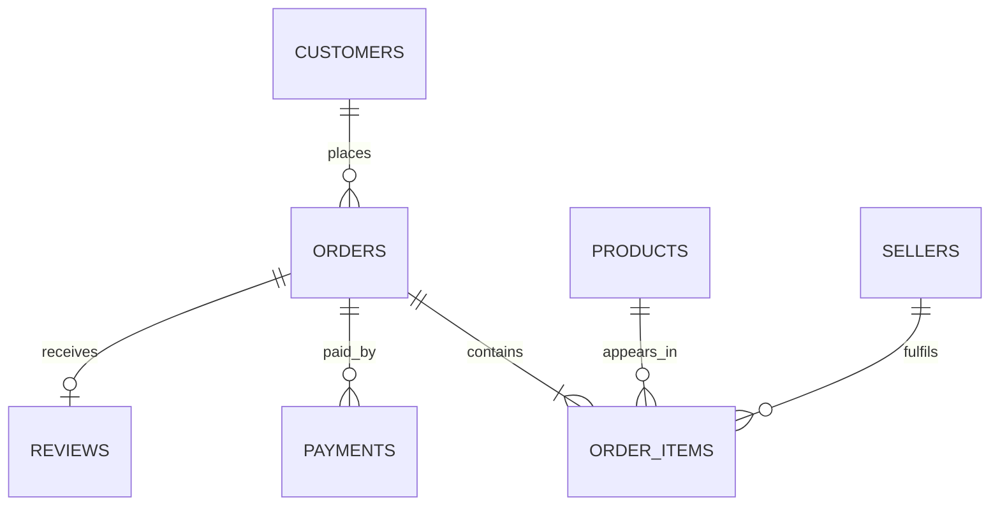

# E-Commerce Revenue & Customer Intelligence Platform

An end-to-end Data Analyst portfolio project built with the public **Brazilian E-Commerce Public Dataset by Olist**. The solution turns nine relational source files into an analysis-ready data model, a SQL warehouse, an Excel management dashboard, and a recruiter-friendly interactive web dashboard.

## Business objective

Management needs one view of commercial performance, customer quality, and fulfilment risk. This project answers five questions:

1. How are orders, delivered GMV, and average order value changing over time?
2. Which customer segments and cohorts create the most value?
3. Which product categories, states, and sellers drive performance?
4. How strongly do delivery delays affect customer reviews?
5. What actions can improve repeat purchase and customer satisfaction?

## Headline findings

- **99,441** total orders and **96,478** delivered orders.
- **R$13.22M** realized merchandise value from delivered orders.
- **R$137.04** average delivered order value.
- **3.0%** repeat-customer rate, showing a large first-to-second purchase opportunity.
- **91.9%** on-time delivery rate.
- Orders delivered 8+ days late average **1.73 stars**, compared with **4.32 stars** for orders delivered at least 8 days early.
- Highest-GMV categories: health & beauty, watches & gifts, bed/bath/table, sports & leisure, and computer accessories.

> Revenue note: the dataset does not include platform commission, cost of goods, marketing spend, or profit. The project uses delivered item value as **realized GMV**, not audited net company revenue.

## Deliverables

| Deliverable | Location | Purpose |
| --- | --- | --- |
| Interactive dashboard | `app/index.html` | Browser-based recruiter demo suitable for GitHub Pages |
| Excel dashboard | `outputs/Ecommerce_Revenue_Customer_Intelligence.xlsx` | Executive summary, trends, customer, operations, and detailed tables |
| SQLite warehouse | `data/warehouse/ecommerce_analytics.db` | Query-ready database with order, customer, and aggregate analytical tables |
| SQL analysis | `sql/analysis_queries.sql` | Ten business queries using CTEs and window functions |
| Python pipeline | `src/build_analytics.py` | Data validation, transformation, RFM, cohort, exports |
| EDA notebook | `notebooks/olist_ecommerce_analysis.ipynb` | Reproducible analytical walkthrough |
| Portfolio case study | `docs/PORTFOLIO_CASE_STUDY.md` | Recruiter-ready project narrative |
| Power BI guide | `docs/POWER_BI_BUILD_GUIDE.md` | Star schema, measures, pages, and visual plan |
| Data dictionary | `docs/DATA_DICTIONARY.md` | Metric and field definitions |

## Analytical model



The pipeline also creates two recruiter-friendly analytical layers:

- `fact_orders`: one row per order for KPI, revenue, delivery, and review analysis.
- `customer_rfm`: one row per delivered customer with recency, frequency, monetary value, and segment.

## How to run

```bash
python -m venv .venv
# Windows: .venv\Scripts\activate
# macOS/Linux: source .venv/bin/activate
pip install -r requirements.txt
python src/download_data.py
python src/build_analytics.py
```

Open the interactive dashboard locally:

```bash
python -m http.server 8000 --directory app
```

Then visit `http://localhost:8000`.

## Publish the recruiter demo

1. Push this project to GitHub.
2. In repository settings, open **Pages**.
3. Select the branch and set `/app` as the publishing folder. If your GitHub Pages setup only supports the repository root or `/docs`, move the four files inside `app` to `/docs`.
4. Add the live URL to your resume and portfolio as **Live Dashboard**.
5. Embed it in a portfolio page with an iframe if the portfolio host allows it:

```html
<iframe
  src="https://YOUR-USERNAME.github.io/YOUR-REPOSITORY/"
  title="E-Commerce Revenue & Customer Intelligence Dashboard"
  width="100%"
  height="900"
  loading="lazy">
</iframe>
```

## Recommended portfolio wording

**E-Commerce Revenue & Customer Intelligence Platform**  
Built an end-to-end analytics solution across 99k+ orders using Python, SQL, Excel, and an interactive web dashboard. Developed a relational data model, RFM customer segmentation, cohort retention analysis, delivery-SLA diagnostics, and category/geographic performance reporting. Identified a 3.0% repeat-customer rate and a 2.59-star review gap between severely late and very early deliveries, translating findings into retention and fulfilment actions.

## Source

- [Brazilian E-Commerce Public Dataset by Olist on Kaggle](https://www.kaggle.com/datasets/olistbr/brazilian-ecommerce)
- Dataset period: 2016–2018; approximately 100k orders across Brazilian marketplaces.

The dataset remains subject to its original Kaggle terms. Project code and original documentation are provided for portfolio and educational use.
